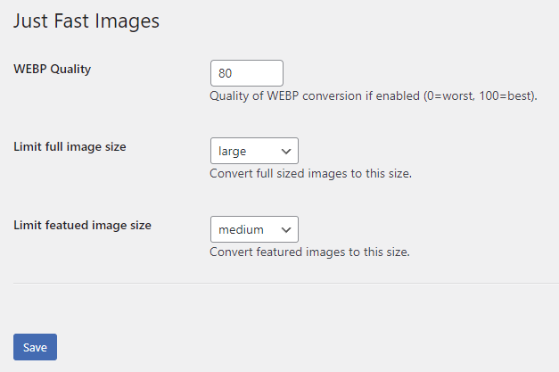

# Just Fast Images
_WordPress Plugin: Just Fast Images_

Automatically optimise and impove image perfomance.

Currently supports the following features:

- Automatic conversion to WEBP format.
- Limiting maximum image size.
- Anonymisation of attachment paths.

## Options

